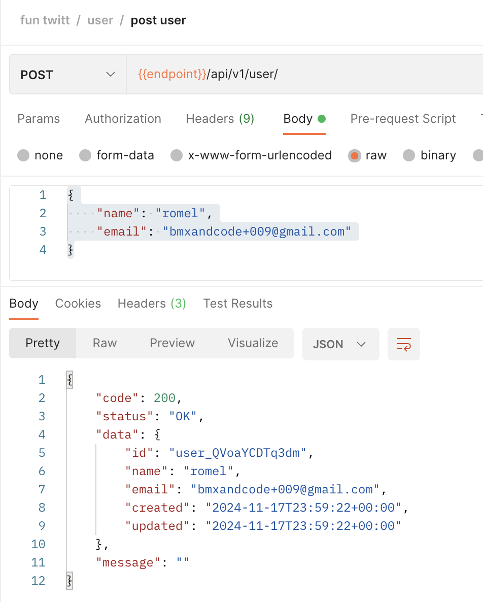
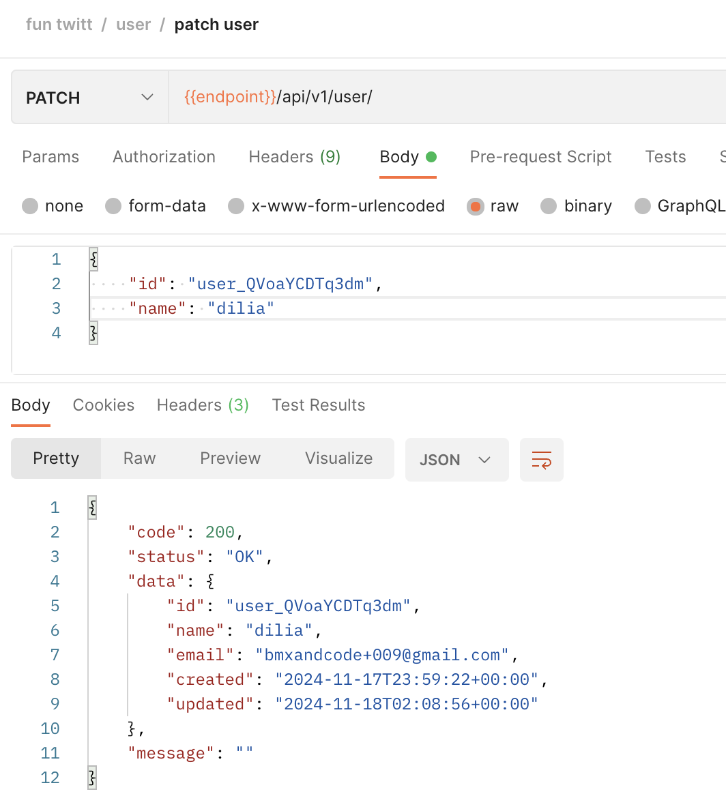
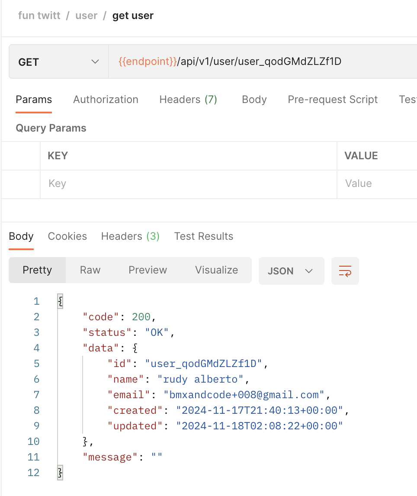
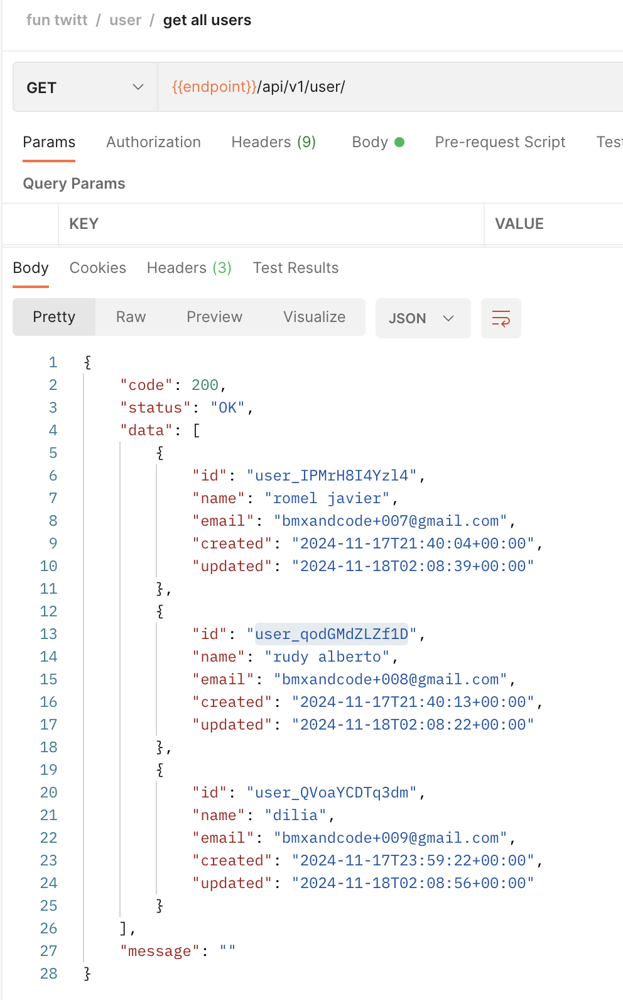
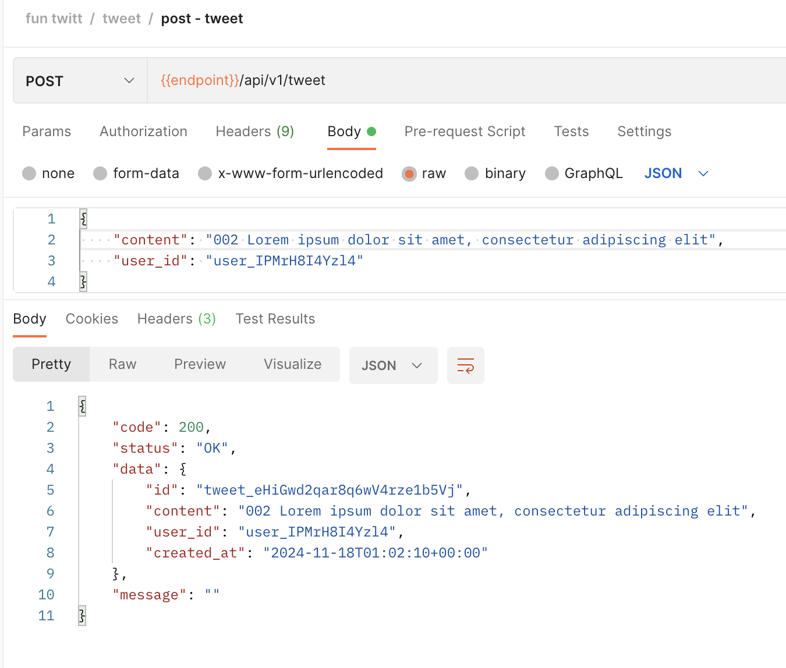
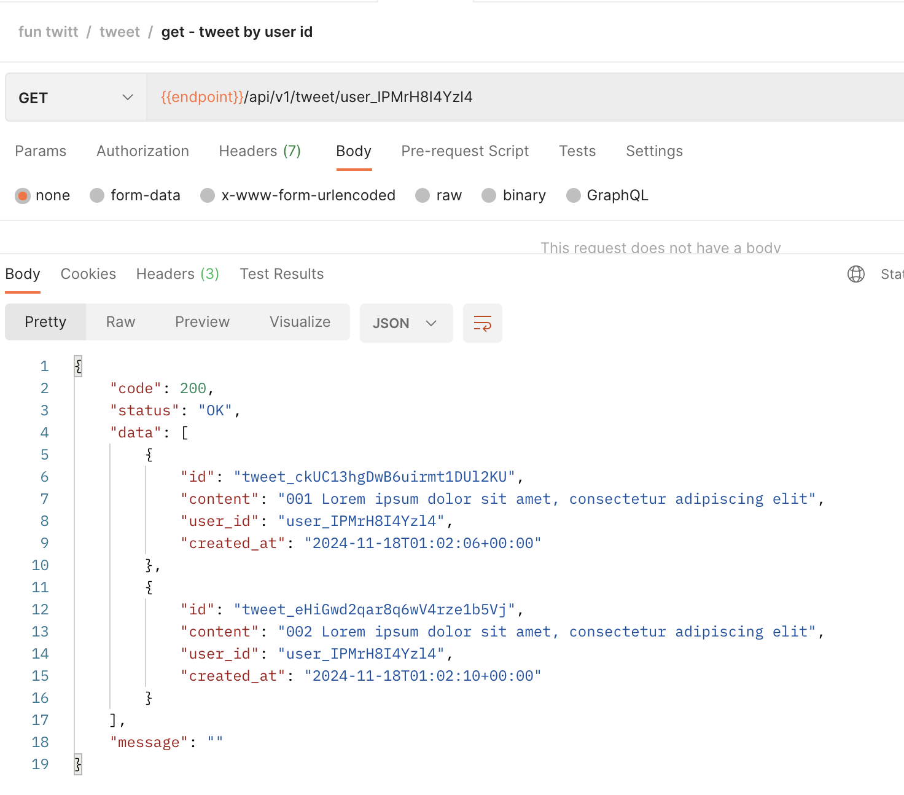
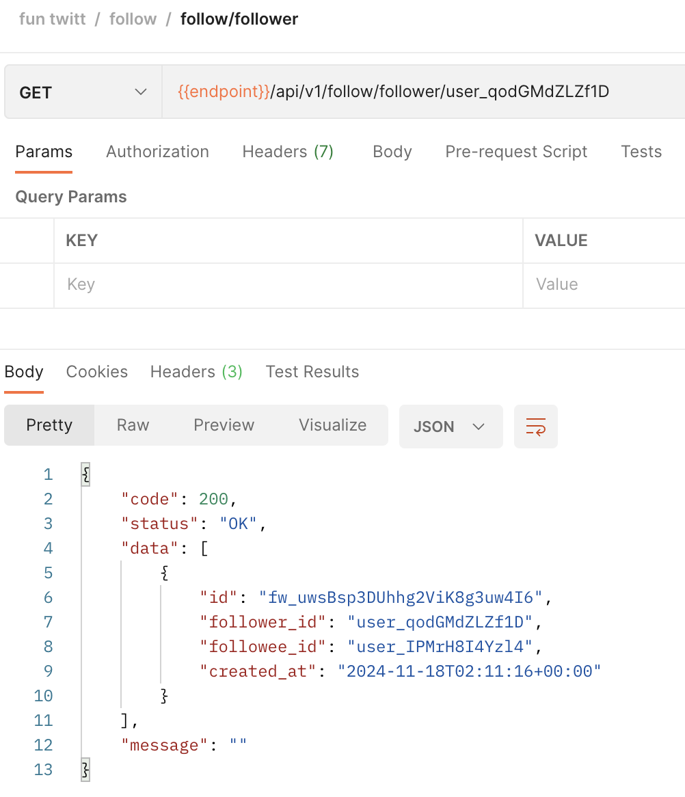
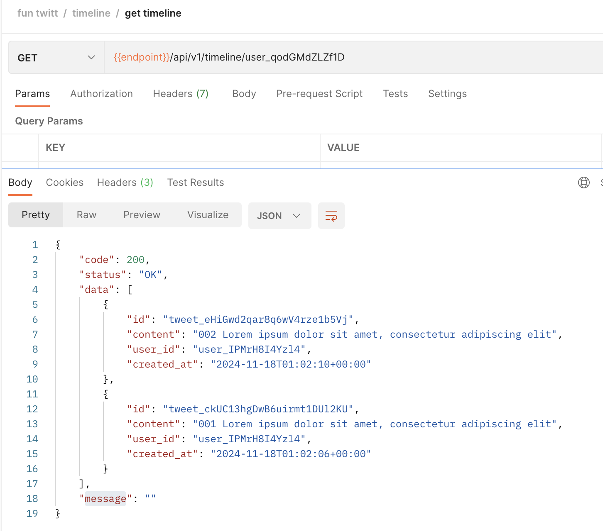

# fun-twitt
fun-twitt is api mock of twitter/X in golang


## models

db provider: `sqlite`

- [X] users  ~ a model ~ ids start with `user_`
- [X] tweets ~ a model ~ ids start with `tweet_` 
- [X] follow ~ a model ~ ids start with `fw_`
- [X] timeline ~ a query

## Setting Up Local Development

1. Run migrations to initialize the database:
   ```bash
   go run github.com/steebchen/prisma-client-go db push

## test

`go test ./... -v` 

## Postman Views

### User model






### Tweet model




### Follow model



### Timeline query

